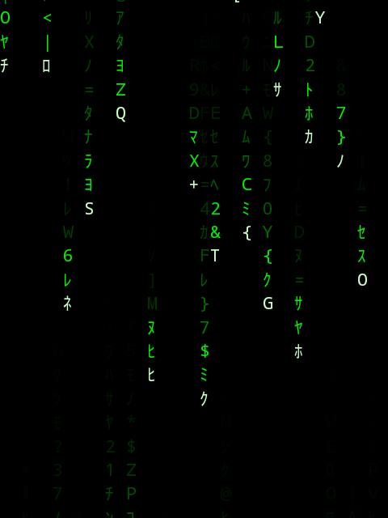

# Roktrix

Matrix rain effect for [Rokid AI Glasses](https://global.rokid.com/products/rokid-glasses) — falling green characters on the transparent waveguide display, with 3DoF head tracking so the rain stays fixed in space as you look around.



## Features

- Classic Matrix rain with Katakana, Latin, digits, and symbols
- 3DoF head-tracked: rain is world-locked using the glasses' gyroscope and accelerometer
- Full 360° horizontal + ±45° vertical coverage (~1000 columns, ~6000 drops)
- Optimized for the 480×640 monochrome green micro-LED display
- Black background = transparent on the waveguide, so characters float in your vision

## Build

```
JAVA_HOME="/Applications/Android Studio.app/Contents/jbr/Contents/Home" \
ANDROID_HOME="$HOME/Library/Android/sdk" \
./gradlew assembleDebug
```

## Install

```
adb install -r app/build/outputs/apk/debug/roktrix-1.0-debug.apk
```

## License & IP

All application code in this repository is original work, written from scratch. No code was copied from any external repository or third-party source.

The project uses only the standard public Android SDK (SensorManager, Canvas, Paint, View) per their documentation. No proprietary Rokid SDK is required.

Licensed under the [MIT License](LICENSE).
